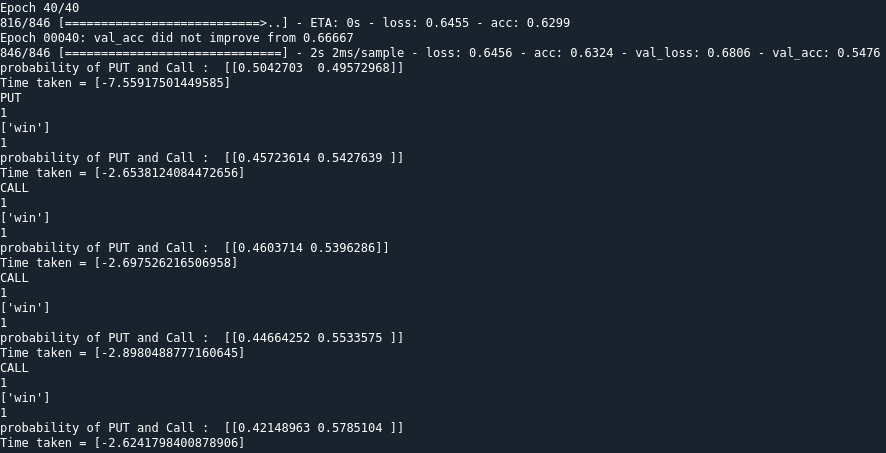

# IQ_Options_Binary_Bot
 Binary Options Trading from the IQ_Options Gateway

# IQ Option Test Trades

# binary-bot
Test 1


Test 2


Test 3


This Project is under development. Any doubts or suggestion can be done  by email at 97josephkibira@gmail.com.

## Contents
- [Motivation](#Motivation)
- [Setup](#Setup)
- [Data](#Data)
- [Getting_started](#Getting_started)

## Motivation

The purpose of this Artificial Intelligence project is to predict the result of the chosen binary option in the future

## Setup
Just open the directory cloned path in terminal and run
```shell
$ pip install -r requirements.txt
```

## Data

The data was gathered from the site IQ option API with the functions already mentioned in the code (iq.py).

## Getting_started

To use the code manteined in this repository, put your own username and password (in iq.py). Any alterations or improvements done in the code can be comunicated by email or in the issues tab.
After adding your personal information, just run the testing.py script and you are ready to go.

### How to Run
```shell
$ python testing.py
```



